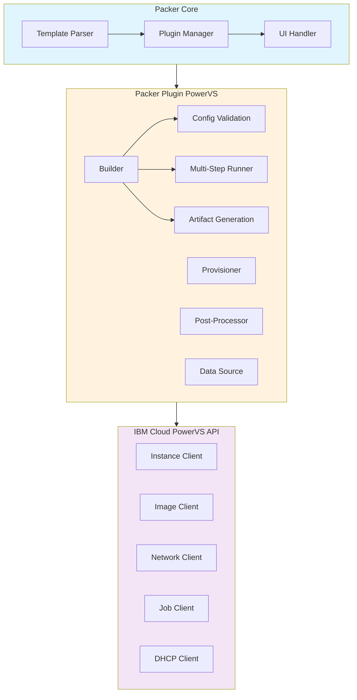
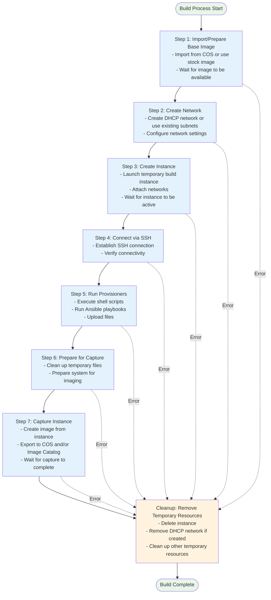

# Architecture and Design

This document describes the architecture, design principles, and implementation details of the Packer Plugin for IBM Cloud Power Virtual Server.

## Table of Contents

- [Overview](#overview)
- [Architecture](#architecture)
- [Component Design](#component-design)
- [Build Process Flow](#build-process-flow)
- [Key Components](#key-components)
- [Data Flow](#data-flow)
- [Error Handling](#error-handling)
- [Security Considerations](#security-considerations)
- [Performance Optimization](#performance-optimization)
- [Extension Points](#extension-points)

## Overview

The Packer Plugin for PowerVS is built on the [Packer Plugin SDK](https://github.com/hashicorp/packer-plugin-sdk) and follows HashiCorp's plugin architecture patterns. It provides a complete solution for creating custom images on IBM Cloud Power Virtual Server infrastructure.

### Design Goals

1. **Simplicity**: Easy to use with sensible defaults
2. **Flexibility**: Support multiple workflows and use cases
3. **Reliability**: Robust error handling and cleanup
4. **Performance**: Efficient resource usage and parallel operations
5. **Maintainability**: Clean code structure and comprehensive tests

### Technology Stack

- **Language**: Go 1.18+
- **Framework**: Packer Plugin SDK v0.6.6+
- **IBM Cloud SDK**: power-go-client v1.14.4+
- **Build Tool**: Make, GoReleaser

## Architecture

### High-Level Architecture



### Plugin Components

```
packer-plugin-powervs/
├── main.go                    # Plugin entry point
├── builder/powervs/           # Builder implementation
│   ├── builder.go            # Main builder logic
│   ├── artifact.go           # Artifact definition
│   ├── step_*.go             # Build steps
│   ├── util.go               # Utility functions
│   └── common/               # Shared configuration
│       ├── access_config.go  # Authentication
│       ├── run_config.go     # Runtime config
│       ├── image_config.go   # Image config
│       └── ssh.go            # SSH helpers
├── provisioner/powervs/       # Provisioner (optional)
├── post-processor/powervs/    # Post-processor (optional)
├── datasource/powervs/        # Data source
└── version/                   # Version info
```

## Component Design

### Builder Component

The builder is the core component responsible for creating PowerVS images.

#### Builder Structure

```go
type Builder struct {
    config Config        // Configuration
    runner multistep.Runner  // Step executor
}

type Config struct {
    common.PackerConfig        // Base Packer config
    powervscommon.AccessConfig // Authentication
    powervscommon.ImageConfig  // Image settings
    powervscommon.RunConfig    // Runtime settings
}
```

#### Builder Lifecycle

1. **Prepare Phase**: Validate configuration
2. **Run Phase**: Execute build steps
3. **Cleanup Phase**: Remove temporary resources

```go
func (b *Builder) Prepare(raws ...interface{}) ([]string, []string, error)
func (b *Builder) Run(ctx context.Context, ui packer.Ui, hook packer.Hook) (packer.Artifact, error)
```

### Configuration Components

#### AccessConfig

Handles IBM Cloud authentication and API client creation.

```go
type AccessConfig struct {
    APIKey            string  // IBM Cloud API key
    Region            string  // PowerVS region
    Zone              string  // PowerVS zone
    AccountID         string  // IBM Cloud account ID
    ServiceInstanceID string  // PowerVS service instance
    Debug             bool    // Enable debug logging
}
```

**Responsibilities:**
- API authentication
- Session management
- Client creation (Image, Instance, Network, Job, DHCP)

#### RunConfig

Defines runtime configuration for the build process.

```go
type RunConfig struct {
    InstanceName   string   // Temporary instance name
    KeyPairName    string   // SSH key pair
    SubnetIDs      []string // Network subnets
    UserData       string   // Cloud-init data
    DHCPNetwork    bool     // Auto-create DHCP network
    Source         Source   // Source image config
    Capture        Capture  // Capture config
    CleanupTimeout string   // Cleanup timeout
    Comm           communicator.Config // SSH config
}
```

#### ImageConfig

Configures source and destination images.

```go
type Source struct {
    Name       string      // Image name
    COS        *COS        // Cloud Object Storage source
    StockImage *StockImage // Stock image source
}

type Capture struct {
    Name        string      // Captured image name
    Destination string      // Where to save (COS/catalog/both)
    COS         *CaptureCOS // COS destination config
}
```

## Build Process Flow

### Multi-Step Execution

The builder uses a multi-step pattern for the build process:


```

### Step Implementation

Each step implements the `multistep.Step` interface:

```go
type Step interface {
    Run(context.Context, multistep.StateBag) multistep.StepAction
    Cleanup(multistep.StateBag)
}
```

**Example: StepCreateInstance**

```go
type StepCreateInstance struct {
    InstanceName   string
    KeyPairName    string
    UserData       string
    CleanupTimeout time.Duration
}

func (s *StepCreateInstance) Run(ctx context.Context, state multistep.StateBag) multistep.StepAction {
    // 1. Get clients from state bag
    // 2. Create instance with configuration
    // 3. Wait for instance to be active
    // 4. Store instance info in state bag
    // 5. Return Continue or Halt
}

func (s *StepCreateInstance) Cleanup(state multistep.StateBag) {
    // 1. Get instance info from state bag
    // 2. Delete instance
    // 3. Wait for deletion with timeout
}
```

## Key Components

### State Bag

The state bag is a shared data structure passed between steps:

```go
state := new(multistep.BasicStateBag)
state.Put("hook", hook)
state.Put("ui", ui)
state.Put("powervsSession", session)
state.Put("imageClient", imageClient)
state.Put("instanceClient", instanceClient)
state.Put("networkClient", networkClient)
state.Put("dhcpClient", dhcpClient)
```

**Key State Variables:**
- `hook`: Packer hook for events
- `ui`: User interface for output
- `error`: Error from failed step
- `instance_id`: Created instance ID
- `network_id`: Created network ID
- `image_id`: Base image ID
- `captured_image`: Captured image details

### API Clients

The plugin uses IBM Cloud SDK clients:

```go
// Image operations
type IBMPIImageClient interface {
    Get(imageID string) (*models.Image, error)
    Create(body *models.CreateImage) (*models.Image, error)
    Delete(imageID string) error
}

// Instance operations
type IBMPIInstanceClient interface {
    Create(body *models.PVMInstanceCreate) (*models.PVMInstance, error)
    Get(instanceID string) (*models.PVMInstance, error)
    Delete(instanceID string) error
}

// Network operations
type IBMPINetworkClient interface {
    Get(networkID string) (*models.Network, error)
    Create(body *models.NetworkCreate) (*models.Network, error)
    Delete(networkID string) error
}
```

### SSH Communicator

SSH communication is handled by Packer's built-in communicator:

```go
&communicator.StepConnect{
    Config:    &b.config.RunConfig.Comm,
    Host:      powervscommon.SSHHost(),
    SSHPort:   powervscommon.Port(),
    SSHConfig: b.config.RunConfig.Comm.SSHConfigFunc(),
}
```

**SSH Helper Functions:**

```go
func SSHHost() func(multistep.StateBag) (string, error) {
    return func(state multistep.StateBag) (string, error) {
        // Extract instance IP from state
        // Return IP address for SSH connection
    }
}

func Port() func(multistep.StateBag) (int, error) {
    return func(state multistep.StateBag) (int, error) {
        return 22, nil // SSH port
    }
}
```

## Data Flow

### Configuration Flow

```
Template File (HCL/JSON)
        ↓
Packer Parser
        ↓
Plugin Prepare()
        ↓
Config Validation
        ↓
Config Struct
        ↓
Build Steps
```

### Runtime Data Flow

```
User Input → Config → State Bag → Steps → API Calls → Resources
                                    ↓
                              State Updates
                                    ↓
                              Next Step
```

### Artifact Flow

```
Captured Image
        ↓
Artifact Creation
        ↓
State Data Attachment
        ↓
Post-Processors (optional)
        ↓
Final Artifact
```

## Error Handling

### Error Propagation

```go
// Step returns error via state bag
if err != nil {
    state.Put("error", fmt.Errorf("failed to create instance: %w", err))
    return multistep.ActionHalt
}
```

### Cleanup on Error

```go
func (s *StepCreateInstance) Cleanup(state multistep.StateBag) {
    // Check if cleanup is needed
    if _, ok := state.GetOk("instance_id"); !ok {
        return // No instance to clean up
    }
    
    // Perform cleanup with timeout
    ctx, cancel := context.WithTimeout(context.Background(), s.CleanupTimeout)
    defer cancel()
    
    // Delete instance
    if err := deleteInstance(ctx, instanceID); err != nil {
        ui.Error(fmt.Sprintf("Error cleaning up instance: %s", err))
    }
}
```

### Retry Logic

```go
func waitForInstanceActive(ctx context.Context, client *instance.IBMPIInstanceClient, instanceID string) error {
    for {
        select {
        case <-ctx.Done():
            return ctx.Err()
        case <-time.After(10 * time.Second):
            inst, err := client.Get(instanceID)
            if err != nil {
                return err
            }
            if *inst.Status == "ACTIVE" {
                return nil
            }
        }
    }
}
```

## Security Considerations

### Credential Management

1. **API Keys**: Never logged or exposed
   ```go
   packer.LogSecretFilter.Set(b.config.APIKey)
   ```

2. **SSH Keys**: Private keys never transmitted
   ```go
   ssh_private_key_file = "~/.ssh/id_rsa"  // Local file only
   ```

3. **COS Credentials**: Filtered from logs
   ```go
   packer.LogSecretFilter.Set(b.config.Capture.COS.AccessKey)
   packer.LogSecretFilter.Set(b.config.Capture.COS.SecretKey)
   ```

### Network Security

1. **SSH Access**: Only during build
2. **Temporary Networks**: Cleaned up after build
3. **Instance Isolation**: Build instances are isolated

### Resource Cleanup

1. **Guaranteed Cleanup**: Cleanup runs even on error
2. **Timeout Protection**: Cleanup has timeout limits
3. **Resource Tracking**: All resources tracked in state

## Performance Optimization

### Parallel Operations

```go
// Multiple sources build in parallel
build {
    sources = [
        "source.powervs.centos",
        "source.powervs.rhel"
    ]
}
```

### Network Optimization

- DHCP networks are faster than custom networks
- Reuse existing networks when possible
- Minimize network configuration changes

### Provisioning Optimization

- Combine shell commands to reduce SSH overhead
- Use local package caching
- Parallelize independent operations

### Resource Reuse

- Reuse base images across builds
- Cache downloaded packages
- Share network configurations

## Extension Points

### Custom Provisioners

Add custom provisioning logic:

```go
provisioner "shell" {
    inline = ["custom-script.sh"]
}

provisioner "ansible" {
    playbook_file = "playbook.yml"
}
```

### Post-Processors

Process artifacts after build:

```go
post-processor "powervs" {
    // Custom post-processing logic
}
```

### Data Sources

Query PowerVS resources:

```go
data "powervs" "images" {
    // Query available images
}
```

### Template Functions

Custom template functions:

```go
instance_name = "packer-${timestamp()}"
image_name = "image-${formatdate("YYYY-MM-DD", timestamp())}"
```

## Future Enhancements

### Planned Features

1. **Multi-Region Support**: Build images across regions
2. **Image Replication**: Automatic image distribution
3. **Advanced Networking**: VPC integration
4. **Cost Optimization**: Spot instance support
5. **Enhanced Monitoring**: Build metrics and telemetry

### Extension Opportunities

1. **Custom Builders**: Specialized build workflows
2. **Integration Plugins**: CI/CD system integration
3. **Validation Tools**: Pre-build validation
4. **Migration Tools**: Import from other platforms

---

**Last Updated**: March 2024  
**Version**: 0.0.1  
**Maintainers**: See [OWNERS](../OWNERS)